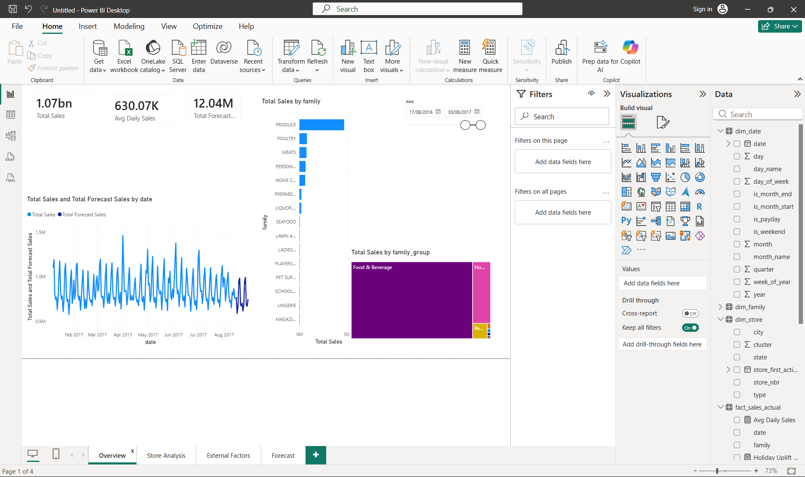
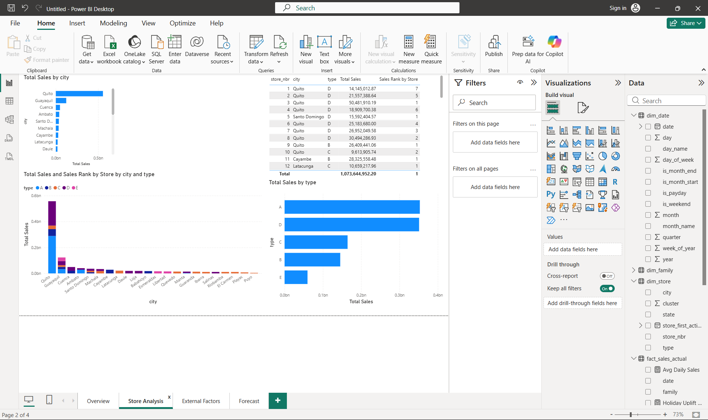

# Store Sales Analytics & Forecasting — Business Case

A retail analytics project built on the [Kaggle "Store Sales – Time Series Forecasting"](https://www.kaggle.com/competitions/store-sales-time-series-forecasting) dataset. Combines sales analytics, demand forecasting, KPI reporting, and a Power BI dashboard to support business decision-making for a multi-store retail chain (Corporación Favorita, Ecuador).

**Quick links:** [Business Case](reports/business_case.md) · [KPI Report](reports/kpi_report.md) · [Forecast Output](reports/forecast_submission.csv)

## Business Problem

Retail chains need accurate, store- and category-level sales forecasts to plan inventory, staffing, and promotions. This project analyzes historical sales data (with external factors like oil prices and holidays) to uncover sales drivers, forecast future demand, and translate findings into KPIs and recommendations for decision-makers.

## Objectives

- Analyze historical sales patterns across stores, product categories, and regions
- Quantify the impact of holidays, promotions, and oil price fluctuations on sales
- Build a forecasting model to predict future sales
- Define and report business KPIs
- Build an interactive Power BI dashboard for ongoing monitoring
- Deliver a business case with actionable recommendations

## Tech Stack

- **Python** (pandas, numpy) — data cleaning & feature engineering
- **Matplotlib / Seaborn** — exploratory data analysis
- **Statsmodels / Prophet / LightGBM** — forecasting
- **Power BI** — interactive dashboard
- **Markdown / Word** — business case report

## Repository Structure

```
store-sales-time-series-forecasting/
├── README.md
├── requirements.txt
├── LICENSE
├── .gitlab-ci.yml              # CI: pytest on push / merge request
├── PORTFOLIO_SUMMARY.md        # resume bullets + LinkedIn blurb
│
├── docs/                       # project documentation (25-document BA/DS pack)
│   ├── README.md               # docs index → 01–25
│   ├── 01_Project_Charter.md … 25_Scenario_Design.md
│   ├── architecture.md         # pipeline overview & data flow
│   ├── data_dictionary.md      # short technical reference
│   └── pipeline.md             # phase runbook
│
├── data/
│   ├── raw/                    # original Kaggle CSVs (not committed — see "Getting the Data")
│   └── processed/              # cleaned, merged, feature-engineered outputs (regenerated by etl/)
│
├── etl/                        # Python batch pipeline — one script per phase (phase0 → phase9)
│   ├── schema.py               # typed contract for every output; enforced on write, validated on read
│   ├── audit.py                # the reconciliations that must hold, shared with the test suite
│   ├── features.py             # shared feature engineering (train + test)
│   ├── phase0_data_understanding.py
│   ├── phase1_cleaning_features.py
│   ├── phase2_eda.py
│   ├── phase3_kpi_reporting.py
│   ├── phase4_forecasting.py
│   ├── phase4b_generate_forecast.py
│   ├── phase5_powerbi_export.py
│   ├── phase6_simulation_layer.py   # simulated commercial layer (price, cost, margin)
│   ├── phase7_procurement.py        # simulated suppliers, purchase orders, receipts
│   ├── phase8_inventory.py          # inventory derived from the receipt flow
│   ├── phase9_pricing.py            # pricing, margin, markdown, margin bridge
│   ├── phase10_price_sensitivity.py # break-even and price-scenario analysis
│   ├── phase11_promotion.py         # observational uplift, placebo test, promo economics
│   └── phase12_scenario.py          # commercial scenarios: a decision layer over the rest
│
├── sql/                        # warehouse-ready SQL equivalents of merge & KPI logic
│   ├── README.md
│   ├── 01_merge_raw_data.sql
│   ├── 02_kpi_headline.sql
│   ├── 03_kpi_store_ranking.sql
│   ├── 04_kpi_category.sql
│   └── 05_monthly_trend.sql
│
├── reports/
│   ├── business_case.md        # Executive Summary, Findings, KPIs, Recommendations
│   ├── kpi_report.md           # detailed KPI tables
│   ├── kpi_summary.csv
│   ├── forecast_submission.csv
│   ├── eda_insights.json
│   ├── model_comparison.json
│   ├── feature_importance.csv
│   └── figures/                # all charts (EDA + model validation, 01–12)
│
├── dashboard/
│   ├── data/                   # star-schema tables (Parquet + CSV) for Power BI
│   │   ├── fact_sales_actual.parquet
│   │   ├── fact_sales_forecast.parquet
│   │   ├── dim_store.csv
│   │   ├── dim_date.csv
│   │   └── dim_family.csv
│   ├── store_sales.pbix        # Power BI file (built locally, not committed)
│   └── screenshots/            # dashboard screenshots for README / portfolio
│
└── tests/                      # pytest unit, data-quality, contract & audit checks
    ├── conftest.py
    ├── test_features.py
    ├── test_data_quality.py
    ├── test_schema_contract.py  # every persisted file against its declared contract
    ├── test_pipeline_audits.py  # the audits must catch deliberately broken frames
    └── test_simulation_layer.py, test_procurement_layer.py, test_inventory_layer.py, test_pricing_layer.py
```

## Project Phases

| Phase | Description | Status |
|---|---|---|
| 0 | Data understanding & merging | ✅ |
| 1 | Data cleaning & feature engineering | ✅ |
| 2 | Exploratory analysis (sales analytics) | ✅ |
| 3 | KPI definition & reporting | ✅ |
| 4 | Forecasting model | ✅ |
| 5 | Power BI dashboard | 🟡 (star-schema data + design doc ready; the `.pbix` was never saved — see docs/18) |
| 6 | Business case write-up | ✅ |
| 7 | Portfolio packaging | 🟡 (README/LICENSE/summary done; GitHub publish + 2 of 4 dashboard screenshots pending) |

*(Status will be updated as each phase is completed.)*

### Track 2 — Commercial, pricing, procurement & retail analytics

Built on the same sales history, with a documented simulation layer for the columns the
competition data does not contain (price, cost, inventory, suppliers) — see
[docs/19_Simulation_Design.md](docs/19_Simulation_Design.md).

| Step | Description | Script | Status |
|---|---|---|---|
| B1 | Commercial simulation layer (price, discount, cost, margin) | `phase6_simulation_layer.py` | ✅ |
| B6 | Procurement & supplier foundation (PO, lead time, spend) | `phase7_procurement.py` | ✅ |
| B4 | Inventory & merchandising (sell-through, turnover, WoS, GMROI, OOS) | `phase8_inventory.py` | ✅ |
| B2 | Pricing & profitability (margin, markdown, price variance) | `phase9_pricing.py` | ✅ |
| B3 | Break-even & price sensitivity | `phase10_price_sensitivity.py` | ✅ |
| B5 | Promotion effectiveness (baseline, uplift, promo ROI) | `phase11_promotion.py` | ✅ |
| B7 | Scenario analysis | `phase12_scenario.py` | ✅ |
| B8 | Commercial cockpit (Executive / Pricing / Procurement / Retail) | `phase13_commercial_export.py` | ☐ |

Step letters follow the locked Track-2 scope; the scripts are numbered in execution order,
because procurement has to exist before inventory can be derived from it.


## Data Notes (from Phase 0)

- **train.csv**: 3,000,888 rows, 2013-01-01 → 2017-08-15, 54 stores × 33 product families, no missing values.
- **test.csv**: 28,512 rows, 2017-08-16 → 2017-08-31 (16-day forecast horizon).
- **stores.csv**: 54 stores across multiple cities/states, each with a `type` and `cluster`.
- **oil.csv**: daily WTI oil price, 43 missing values (weekends/holidays) — forward/backward-filled during merge.
- **holidays_events.csv**: 350 records; contains duplicate entries per date (a holiday + its "transferred" counterpart) — deduplicated by date before merging to avoid inflating row counts.
- **transactions.csv**: store-day transaction counts; ~245.8k rows in the merged dataset have no matching transaction record (dates/stores not covered in this file) — to be handled in Phase 1.
- Merged working dataset: `data/processed/merged_train.parquet` (3,000,888 rows × 15 columns).
- **Unit semantics**: `sales` is a **quantity, not a currency amount** — 15.4% of its values are fractional (weighed goods such as BREAD/BAKERY, DELI, FROZEN FOODS), and the dataset ships no price column. Every sales figure in this repo is therefore **unit sales**; no revenue, margin or price KPI is derived from this data alone.

## Data Notes (from Phase 1)

- **Missing transactions**: 245,784 rows (98.7% of them also have `sales == 0`) — filled with 0, original state kept in a `transactions_missing` flag rather than silently dropped.
- **Time features**: `year, month, day, day_of_week, day_of_year, week_of_year, quarter, is_weekend, is_month_start, is_month_end`, plus `is_payday` — a domain-specific feature from the competition brief (Ecuadorian public-sector wages are paid on the 15th and last day of each month, which historically bumps retail sales).
- **Store lifecycle**: `days_since_store_open`, since several stores (e.g. store 52) started operating partway through the data window — without this, a model would misread "store not yet open" as "store with no demand."
- **Outliers**: 2,912 rows (0.10%) flagged as extreme sales values (>99.9th percentile within their product family) via `sales_outlier_flag` — flagged, not removed, since these are real demand spikes (e.g. holidays).
- **Leakage guard**: `transactions` is intentionally excluded from the prepared test/forecast set — it's a same-day metric not known in advance at prediction time.
- Outputs: `data/processed/cleaned_train.parquet` (3,000,888 rows × 30 cols), `data/processed/prepared_test.parquet` (28,512 rows × 26 cols).

## Data Notes (from Phase 2 — Sales Analytics)

- **Growth**: total sales roughly doubled from 2013 to 2016 (+~106% YoY cumulative).
- **Weekly seasonality**: weekend sales run ~39% higher on average than weekdays.
- **Category concentration**: the top 3 families (Grocery I, Beverages, Produce) account for ~64% of total sales.
- **Holidays**: national holidays show a ~19% average sales uplift vs regular days.
- **Payday**: the 15th/month-end shows only a modest ~1.4% uplift in this simple day-level comparison — likely diluted by category mix; worth revisiting per-family in a later pass.
- **Oil price**: monthly sales and average oil price are strongly negatively correlated (r ≈ -0.75) over this period — a macro pattern, not necessarily a direct causal driver at store level.
- **Promotions**: rows with `onpromotion > 0` show much higher average sales (~+619%) than non-promoted rows — read this as correlation (promoted items tend to be high-volume categories already), not pure promotion lift; a fair causal estimate needs a controlled comparison, planned for Phase 4.
- Figures: `reports/figures/01`–`09` (trend, seasonality, category/region breakdowns, holiday/payday/oil effects). Raw numbers: `reports/eda_insights.json`.

## Data Notes (from Phase 3 — KPI Reporting)

- Full KPI report: `reports/kpi_report.md` (headline KPIs, store ranking, category performance, monthly trend).
- Machine-readable tables for reuse (Power BI, business case): `reports/kpi_summary.csv`, `data/processed/kpi_store.csv`, `kpi_category.csv`, `kpi_monthly.csv`.
- Total unit sales across the training window: **1.07B units**. Store ranking is led entirely by Quito locations; the lowest-ranked store (52) is partly a lifecycle artifact (opened partway through the data window), not pure underperformance.

## Data Notes (from Phase 4 — Forecasting)

- **Validation design**: last 16 days of train (2017-07-31 → 2017-08-15) held out, same horizon length as the real test set — avoids leakage while giving a fair, labeled comparison.
- **Models compared (RMSLE, lower is better)**: Naive last-value 0.660 → Same-weekday avg (4wk) 0.531 → 28-day moving average 0.522 → **LightGBM 0.465** (best, ~11% better than the strongest baseline).
- **Verified on the real Kaggle leaderboard**: the actual submission (`reports/forecast_submission.csv`) scored **RMSLE 0.48464** on Kaggle's own held-out test set — close to our internal validation estimate (0.465), confirming the validation methodology generalizes well to unseen data.
- **Top predictive features**: `store_nbr`, `family`, `days_since_store_open`, `day_of_year`, `onpromotion` — store identity and product category dominate, but the engineered lifecycle/calendar features earn their place in the top 5.
- **Compute-budget note**: trained on a random 900k-row sample (of ~2.97M available) due to the 2-core sandbox this ran in; retraining on the full set on a normal machine would likely improve results further.
- Forecast for the actual competition test window (2017-08-16 → 2017-08-31): `reports/forecast_submission.csv` (Kaggle submission format) and `data/processed/forecast_detail.parquet` (with date/store/family for dashboard use) — generated by `etl/phase4b_generate_forecast.py`, which scores the saved model from `phase4_forecasting.py` on `prepared_test.parquet`.
- Model file: `data/processed/lightgbm_model.txt`. Figures: `reports/figures/10`–`12` (actual vs forecast, feature importance, model comparison).

## Data Notes (from Phase 5 — Power BI Export)

- Star schema exported to `dashboard/data/`: 2 fact tables (`fact_sales_actual`, `fact_sales_forecast`) + 3 dimension tables (`dim_store`, `dim_date`, `dim_family`, the last with a business-friendly `family_group` for drill-down).
- Fact tables are Parquet (Power BI Desktop reads Parquet natively via Get Data); dimensions are CSV.
- Relationships, DAX measures, page layout, and slicers are documented in `docs/17_Dashboard_Design.md`.
- Actual `.pbix` file and screenshots are built locally in Power BI Desktop (not generated here).

## Data Notes (from Phase 6 — Commercial Simulation Layer)

- The competition data has no price, cost, inventory or supplier column, so every commercial KPI needs a modeled layer. `etl/phase6_simulation_layer.py` adds one **beside** the real tables, never inside them: real columns keep their plain names (`units`, `onpromotion`), every simulated column ends in `_sim`, and a test fails if that convention is broken.
- Promotion **occurrence and exposure are real** (`onpromotion`); the **discount depth is simulated** — 5% at the lowest exposure, up to 30% at the highest. `onpromotion` records that a promotion ran, never how deep the price cut was.
- List price is store-indexed but cost is carried centrally, so margins differ across stores for a reason that can be explained rather than by random noise.
- Calibration: **simulated** revenue of 2.30B USD on 1.07B real units, **22.6% simulated chain gross margin** (thinnest GROCERY I 18.0%, widest LINGERIE 54.3%), 12.6% average simulated discount across the 611,329 promoted rows. Cost ratios are scenario assumptions, not estimates of Favorita's real costs; the declared scenario bounds (20–28%) are asserted in the test suite, so a later change to the price book fails loudly instead of drifting silently.
- Every monetary figure carries its provenance wherever it appears — "simulated revenue", never "revenue". That rule (P-06) applies to reports, dashboard KPI titles and CV bullets alike.
- Full rule set, price book, and the limits of what may be claimed from it: [docs/19_Simulation_Design.md](docs/19_Simulation_Design.md).

## Data Notes (from Phase 7 — Procurement Simulation)

- Suppliers, purchase orders and receipts do not exist in the competition data, so this layer creates them: 14 suppliers in 6 sourcing groups, every family dual-sourced inside its group so the same family can be compared across suppliers — which is what makes purchase price variance mean anything.
- The **demand signal is real** (`units`); the ordering policy, forecast error, lead times, fill rates and prices are simulated. The whole table is marked by its name (`fact_purchase_order_sim`, rule P-07) rather than by a suffix on every column.
- Orders are placed weekly for the following week with an `N(0, 15%)` planner forecast error and **no safety margin**, lot-sized against the family's planning order multiple: demand accumulates across weeks and an order is raised only when it crosses the next multiple. That forecast error — not a random stock number — is what produces genuine overstock and out-of-stock situations once phase 8 derives inventory from these receipts.
- The supplier master encodes a cost-versus-service tension on purpose, otherwise the analysis has nothing to find. A test guards the design contract — differentiated prices and service levels, all parameters inside documented bounds, at least one cheaper-but-less-reliable pair — but deliberately does not assert which suppliers rank worst. That is for the analysis to find, not for the test to impose.
- Scenario result: **simulated** spend of 1.77B USD over 294,535 PO lines in 135,541 orders, 86.5% on-time and 93.7% in-full delivery, average lead time 8.1 days against 7.6 planned. Declared bounds (OTD 80–92%, in-full 90–97%) are asserted in the test suite.
- Rules, supplier master and limits: [docs/20_Procurement_Simulation.md](docs/20_Procurement_Simulation.md).

## Data Notes (from Phase 8 — Inventory & Merchandising)

- Stock on hand is **derived**, never invented: every unit arrived through a phase-7 purchase order. The full lineage is reconstructable per store × family × date — `PO → Receipt → Opening → Observed Units → Fulfilled → Unfulfilled → Closing`.
- The equation `closing = opening + receipts − fulfilled`, `opening(t+1) = closing(t)` closes exactly, with **no balancing plug and no hidden stock adjustment**. Fulfilment is capped at availability so stock never goes negative, but a shortage is never absorbed either — it surfaces as `unfulfilled_units_sim`. The script aborts, and the test suite fails, if the chain does not reconcile. The seven lineage columns are stored as float64 because the audit has to hold in the delivered file, not only in memory.
- **Observed sales are not demand.** The dataset has neither an inventory nor a demand column, so a gap between observed quantity and simulated availability is a shortage of *this* supply chain — never Favorita's historical lost sales. Every rate is a *simulated* OOS rate, and a test fails on any column name containing "lost", "missed" or "forgone".
- Store-side fulfilment is named `simulated_demand_fulfillment_rate_pct` so it can never be confused with the supplier OTD and in-full rates of phase 7. They measure different things and stay in different layers.
- Scenario result: 98.5% simulated demand fulfillment rate, 1.6% simulated OOS day rate, sell-through 93–99%, weeks of supply 3–5 for slow movers, stock turnover ≈ 29–33 p.a. for fast movers.
- Building this phase is what exposed the phase-7 ordering flaw fixed in the previous commit. That is the point of deriving inventory instead of generating it: the downstream result corrected an upstream business rule.
- Equation, audit, KPI definitions and limits: [docs/21_Inventory_Simulation.md](docs/21_Inventory_Simulation.md).

## Data Notes (from Phase 9 — Pricing & Profitability)

- No new simulated data. This phase turns the existing chain into commercial KPIs and is built around one reconciliation: **which quantity carries the revenue**.
- Phase 6 priced every *observed* unit; phase 8 showed the simulated supply chain could not always deliver them. Booking revenue on observed units would credit the scenario with goods that, inside the same scenario, were never on the shelf. So revenue is booked on **fulfilled** quantity from here on, and the demand-side figure is kept only as the potential the shortfall is measured against: 2.297B USD potential, **2.263B USD fulfilled**, 33.9M USD shortfall (1.48%).
- That identity only holds in float64 — a float32 × float32 product stays float32 in pandas and silently loses the precision it depends on, which is why `observed_units` was widened in phase 8.
- Headline (simulated): 194.2M USD markdown given away (7.9% of list revenue), 511.1M USD gross margin at **22.6%** — the same margin structure the price book was calibrated to in docs/19, surviving the supply constraint without being re-tuned.
- The margin bridge decomposes each year's margin change into volume, price and cost effects, computed per family so product mix needs no residual term. Families absent in one of the two years are labelled `assortment_change` and booked to volume — otherwise the terms would be `NaN` and a skipna sum would quietly drop them, which is how a bridge stops adding up unnoticed.
- Store price position is basket-adjusted against the chain's average net price per family, so a store selling cheap families is not mistaken for a cheap store.
- Definitions, bridge formulas and limits: [docs/22_Pricing_Profitability.md](docs/22_Pricing_Profitability.md). Readable summary: [reports/pricing_profitability_sim.md](reports/pricing_profitability_sim.md).

## Data Notes (from Phase 10 — Price Sensitivity & Break-even)

- This phase **refuses to estimate a price elasticity**, and that refusal is the design decision. `net_price_sim` is generated by the phase-6 rules, so regressing quantity on it recovers those rules, not customer behaviour.
- Instead it answers the pricing question with **break-even arithmetic**, which needs no behavioural assumption at all: `Q'/Q = m / (m + x)`. At the chain's 22.6% simulated margin, a 5% price rise can afford to lose 18.1% of volume; a 10% discount must win 79.5% more.
- The finding is that break-even depends entirely on the starting margin, so the same discount is a different proposition per category — for thin-margin staples a 10% cut needs the volume to roughly double before it pays for itself. That is a usable pricing rule with nothing estimated.
- Where a price cut is deeper than the margin, **no volume restores it**; those rows are flagged `margin_cannot_be_restored` and carry no ratio rather than a misleading number. Below-cost rows are flagged and kept, never dropped.
- A scenario grid runs three **explicit assumptions** (−1.0, −1.5, −2.0) through volume → revenue → COGS → margin, reporting `margin_change_vs_baseline_pct` next to the revenue change — because a price increase can lose revenue while gaining margin, and that trade-off is the actual decision.
- The price/volume regression is kept only as a **methodological guardrail**: fitted slopes run from **+8.6 to −8.5**, which is the demonstration. A positive "elasticity" is not a weak result, it is a meaningless one — the slope measures promotion intensity, a shared cause of both the discount and the volume. It lives in a `diagnostic_` file, outside the KPI outputs, and a test keeps it there.
- Design, formulas and the guardrail: [docs/23_Price_Sensitivity_Design.md](docs/23_Price_Sensitivity_Design.md). Readable summary: [reports/price_sensitivity_sim.md](reports/price_sensitivity_sim.md).

## Data Notes (from Phase 11 — Promotion Effectiveness)

- Three tiers are kept apart **by file name**: `_observational` (real inputs, calendar-matched baseline), `_sim` (anything touching simulated discount depth or margin) and `diagnostic_` (method validity, not findings). A test asserts no observational table carries a simulated column.
- `onpromotion` was verified against the raw data before anything was built: 362 distinct values, up to 741, median 4 on promoted rows. It counts **promoted items** — promotion *breadth*, not discount depth. Depth is simulated, so the two are never merged into one "intensity" measure.
- **The headline result is a number getting smaller.** The naive promo comparison in the KPI report gives +619%; against a calendar-matched baseline the chain-level estimate is **+52.3%**. Most of the naive figure was category and calendar composition.
- **And it is still not causal.** The same estimator on *fake* promotion days — sampled to match the real promotion calendar, baselines rebuilt without them — returns **+10.6%**. That indicates residual calendar/selection structure and limits causal interpretation. It is a method-validity diagnostic, not a lower bound: nothing subtracts one from the other, and a test forbids storing such a difference.
- Scenario economics compare two scenarios directly (`GM_promotion = Q₁(P_promo − C)` against `GM_baseline = Q₀(P_list − C)`) rather than decomposing by hand, and put the **required** uplift from the break-even formula beside the **estimated** one: 8 of 32 families cleared the requirement. The wording stays *observed uplift exceeded the scenario break-even requirement*, never *the promotion was profitable*.
- Cross-family displacement is reported as an **identification diagnostic**, not a cannibalisation analysis: other families move **+12.2%** on promotion days (up, not down) against **+4.3%** on placebo days — inconsistent with a simple displacement story, and a sign that promotion days differ systematically from ordinary ones. Which mechanism causes that is not identified here. Conclusion: cannibalisation cannot be reliably identified from this aggregation and design. Naming the limit is the result.
- Every chain-level figure is a **ratio of sums**, never a mean of per-family ratios — the two differ by more than a percentage point here, and a mean would make the real and placebo numbers incomparable. The totals behind each quoted figure are stored in the output files and a test recomputes them against the report.
- Design, estimator and limits: [docs/24_Promotion_Effectiveness_Design.md](docs/24_Promotion_Effectiveness_Design.md). Report: [reports/promotion_effectiveness.md](reports/promotion_effectiveness.md).

## Data Notes (from Phase 12 — Commercial Scenarios)

- A **decision layer, not a new simulation**: pricing, break-even, inventory, procurement and promotion are connected to three policy levers and scored on one common KPI set — revenue, gross margin, markdown, procurement spend, fulfilment, inventory, OOS.
- The anchor is an audit: **scenario S0 must reproduce the committed phase-9 KPIs exactly**, checked against the persisted files on every run. A decision layer that drifts from its own baseline is describing a different business, so the phase fails rather than reports.
- **S1 Margin Protection** (halve the discount on below-median-margin families): revenue −1.9%, **gross margin +11.2%**, markdown −49.7%, procurement spend −5.7%. A revenue report alone would call this a loss — which is why the common KPI set exists.
- **S2 Availability First** (re-source the OOS-prone quartile to the more reliable supplier): almost nothing moves. Baseline fulfilment is already 98.5%, so there is little left to buy with a costlier supplier. That is a result — availability is not the binding constraint here.
- **S3 Growth** (deepen the discount only where estimated uplift cleared break-even): revenue +0.6%, gross margin −3.5%. The B5 gate and the −1.5 elasticity assumption **disagree**, and the report says so: the gate is observational and selects families, the elasticity is an assumption about how they respond. Which one you believe is the actual decision.
- The observational uplift is used **only as a qualification filter**, never as a response function. Volume responds to price through the stated elasticity assumption of docs/23, not through anything estimated here.
- Levers, mappings and limits: [docs/25_Scenario_Design.md](docs/25_Scenario_Design.md). Report: [reports/commercial_scenarios_sim.md](reports/commercial_scenarios_sim.md).

## Key Results

- **Total unit sales analyzed**: 1.07B units across 54 stores, 33 categories, 2013–2017.
- **Best forecasting model**: LightGBM, RMSLE 0.465 (vs 0.522 best baseline).
- **Biggest sales drivers**: store location/type, product category, promotions, and store lifecycle stage.
- **External factors**: national holidays +19% sales, weekends +39%, oil price strongly (negatively) correlated with monthly sales trend.

## Dashboard Preview

**Overview page** — headline KPI cards, category breakdown, and an actual-vs-forecast daily sales trend:



**Store Analysis page** — sales by city, store ranking table, and sales by store type:



*More pages (External Factors, Forecast) to be added as screenshots come in.*

## Getting the Data

Raw CSVs are **not committed** to this repo — Kaggle's competition rules restrict redistributing competition data, and the raw files are ~140MB combined (not ideal for git anyway). To reproduce:

1. Download the data from the [competition page](https://www.kaggle.com/competitions/store-sales-time-series-forecasting/data) (requires a free Kaggle account)
2. Place the CSVs in `data/raw/`
3. Run the pipeline below — every processed file is regenerated from there

## How to Run

```bash
pip install -r requirements.txt

python etl/phase0_data_understanding.py      # merge raw data
python etl/phase1_cleaning_features.py       # clean + engineer features
python etl/phase2_eda.py                     # exploratory analysis -> reports/figures/
python etl/phase3_kpi_reporting.py           # KPI tables -> reports/ and data/processed/
python etl/phase4_forecasting.py             # train + validate forecasting model
python etl/phase4b_generate_forecast.py      # score the model on prepared_test.parquet -> forecast files
python etl/phase5_powerbi_export.py          # star-schema export -> dashboard/data/
python etl/phase6_simulation_layer.py        # simulated commercial layer -> data/processed/
python etl/phase7_procurement.py             # simulated suppliers / POs / receipts
python etl/phase8_inventory.py               # inventory derived from receipts -> KPIs
python etl/phase9_pricing.py                 # pricing / margin / markdown / margin bridge
python etl/phase10_price_sensitivity.py      # break-even + price scenarios
python etl/phase11_promotion.py              # promotion uplift, placebo, economics
python etl/phase12_scenario.py               # commercial scenarios on one KPI set

pytest tests/ -v                             # run unit & data-quality tests
```

Then open Power BI Desktop and follow `docs/17_Dashboard_Design.md` to build the dashboard.

## Run with Docker

The pipeline and test suite also run in a container — no local Python setup needed:

```bash
docker build -t sales-forecast .

# Run the test suite (feature tests always run; data-quality tests skip
# cleanly without data, and pass against the real 3M-row dataset when mounted)
docker run --rm sales-forecast
docker run --rm -v "$(pwd)/data:/app/data" sales-forecast

# Run any ETL phase inside the container
docker run --rm -v "$(pwd)/data:/app/data" sales-forecast python etl/phase3_kpi_reporting.py
```

`.gitlab-ci.yml` builds this image and runs the containerized test suite on every push/merge request (`docker-build` job), and pushes it to the project's Container Registry on `main` (`docker-push` job).

## Interactive Dashboard (Streamlit)

A lightweight alternative to the Power BI dashboard — no desktop app needed,
runs anywhere Python does, reads the same pre-aggregated KPI tables so it
starts instantly:

```bash
pip install -r requirements.txt
streamlit run dashboard/app.py
```

Opens at `http://localhost:8501` — KPI cards, monthly sales trend, model
comparison (LightGBM vs. baselines), actual-vs-forecast on the validation
window, a filterable store ranking, and category share.

## Author

Maryam
