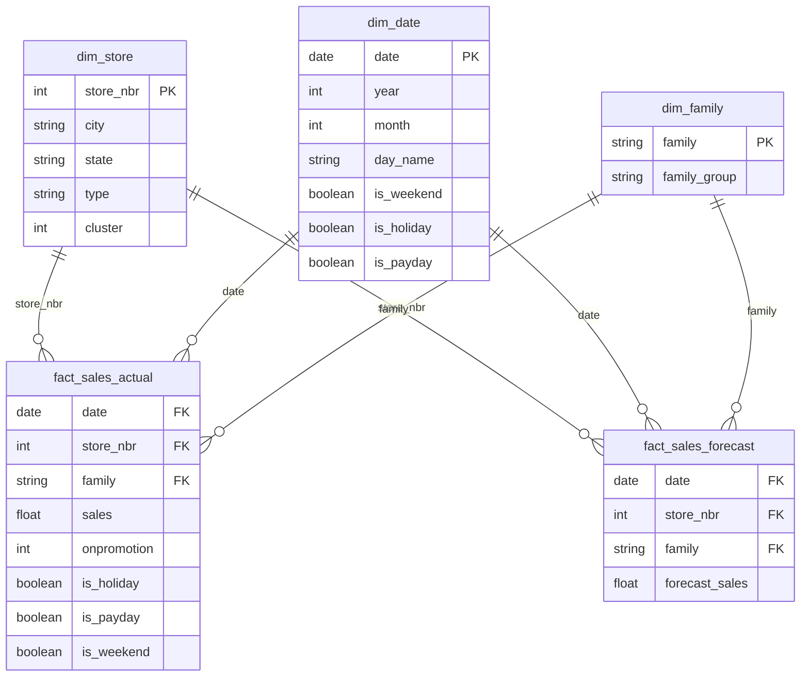

# 16 — Data Model

**Version:** 1.0  

---

## 1. Conceptual model

```
┌─────────────┐     ┌─────────────┐     ┌─────────────┐
│   STORE     │     │   PRODUCT   │     │   DATE      │
│  (54 rows)  │     │  (33 families)│   │ (calendar)  │
└──────┬──────┘     └──────┬──────┘     └──────┬──────┘
       │                   │                   │
       └─────────┬─────────┴─────────┬─────────┘
                 ▼                   ▼
          ┌─────────────┐     ┌─────────────┐
          │ SALES       │     │ FORECAST    │
          │ (actual)    │     │ (predicted) │
          └─────────────┘     └─────────────┘
                 │                   │
       ┌─────────┴─────────┐         │
       ▼                   ▼         ▼
┌─────────────┐     ┌─────────────┐
│ OIL PRICE   │     │ HOLIDAY     │
│ (daily)     │     │ (events)    │
└─────────────┘     └─────────────┘
```

**Grain:** store × product family × day

---

## 2. Logical model (processed layer)

### Entity: SalesFact (cleaned_train.parquet)

| Attribute | Type | FK |
|---|---|---|
| id | PK | |
| date | FK → Date | |
| store_nbr | FK → Store | |
| family | FK → ProductFamily | |
| sales | measure | |
| onpromotion | measure | |
| transactions | measure (historical only) | |
| dcoilwtico | FK → OilPrice (via date) | |
| is_holiday | derived | |
| is_payday | derived | |
| is_weekend | derived | |
| days_since_store_open | derived | |

### Entity: Store (stores.csv / dim_store)

| Attribute | Type |
|---|---|
| store_nbr | PK |
| city | |
| state | |
| type | |
| cluster | |

### Entity: ProductFamily (dim_family)

| Attribute | Type |
|---|---|
| family | PK |
| family_group | business grouping |

---

## 3. Physical model — Power BI star schema



---

## 4. Relationships (Power BI)

| From | To | Cardinality | Cross-filter |
|---|---|---|---|
| dim_store[store_nbr] | fact_sales_actual[store_nbr] | 1 : many | Single |
| dim_store[store_nbr] | fact_sales_forecast[store_nbr] | 1 : many | Single |
| dim_date[date] | fact_sales_actual[date] | 1 : many | Single |
| dim_date[date] | fact_sales_forecast[date] | 1 : many | Single |
| dim_family[family] | fact_sales_actual[family] | 1 : many | Single |
| dim_family[family] | fact_sales_forecast[family] | 1 : many | Single |

**Pattern:** Two fact tables sharing conformed dimensions (actual + forecast).

---

## 5. File mapping

| Model layer | File | Rows (approx.) |
|---|---|---|
| Raw sales | data/raw/train.csv | 3,000,888 |
| Merged | data/processed/merged_train.parquet | 3,000,888 |
| Cleaned | data/processed/cleaned_train.parquet | 3,000,888 |
| Fact actual | dashboard/data/fact_sales_actual.parquet | 3,000,888 |
| Fact forecast | dashboard/data/fact_sales_forecast.parquet | 28,512 |
| Dim store | dashboard/data/dim_store.csv | 54 |
| Dim date | dashboard/data/dim_date.csv | ~1,700 |
| Dim family | dashboard/data/dim_family.csv | 33 |

---

## 6. Forecasting feature model (ML)

Features used by LightGBM (top 5 by importance):

| Feature | Type | Source |
|---|---|---|
| store_nbr | categorical | stores |
| family | categorical | train |
| days_since_store_open | numeric | engineered |
| day_of_year | numeric | engineered |
| onpromotion | numeric | train/test |

**Excluded:** transactions (leakage), sales (target)

---

## 7. SQL model equivalents

See `sql/01_merge_raw_data.sql` for relational merge logic and `sql/02–05` for KPI aggregations over `cleaned_train` view.

---

## 8. Related documents

- [08_Data_Dictionary.md](08_Data_Dictionary.md)
- [15_ETL_Design.md](15_ETL_Design.md)
- [17_Dashboard_Design.md](17_Dashboard_Design.md)
