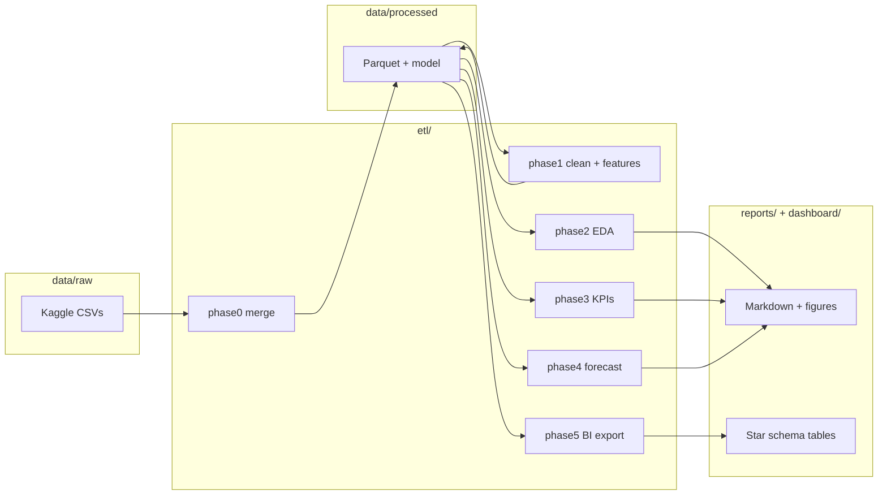

# Architecture

## Overview

Store Sales Analytics & Forecasting is a batch analytics pipeline built on the [Kaggle Store Sales](https://www.kaggle.com/competitions/store-sales-time-series-forecasting) dataset. It follows a classic **medallion-style** flow: raw CSVs → cleaned Parquet → analytical reports → BI star schema.

## Layer responsibilities

| Layer | Folder | Role |
|---|---|---|
| **Raw** | `data/raw/` | Immutable Kaggle source files (not committed) |
| **ETL** | `etl/` | Python batch jobs — one script per phase, run in order |
| **Processed** | `data/processed/` | Intermediate and final analytical datasets |
| **SQL** | `sql/` | Equivalent analytical queries for warehouse / BI tools |
| **Reports** | `reports/` | Human-readable outputs, charts, submission file |
| **Dashboard** | `dashboard/` | Power BI star-schema export + build guide |
| **Tests** | `tests/` | Unit and data-quality checks |
| **CI** | `.gitlab-ci.yml` | Automated test stage on every push |

## Design principles

1. **Reproducibility** — every artifact in `data/processed/` and `reports/` can be regenerated from raw data by running the ETL scripts in order.
2. **No leakage** — `transactions` is excluded from the forecast feature set because it is not known at prediction time.
3. **Documented cleaning** — missing values, outliers, and holiday deduplication are flagged or filled with explicit rationale (see README Data Notes).
4. **Separation of concerns** — shared feature logic lives in `etl/features.py`; each phase script owns one step of the pipeline.

## External dependencies

- **Python 3.10+** with pandas, LightGBM, matplotlib
- **Power BI Desktop** (local) for dashboard build — data export is automated, `.pbix` is built manually
